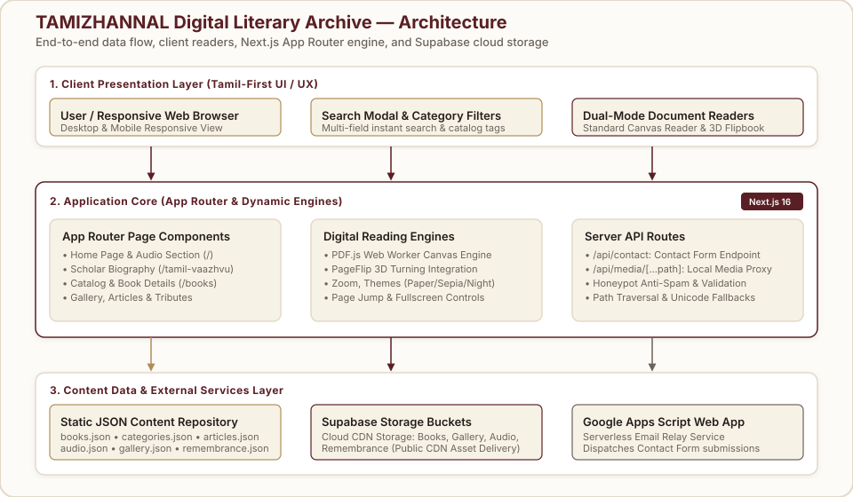

<div align="center">

# TAMIZHANNAL — Digital Literary Archive

### Preserving Tamil Literary Heritage Through a Modern Digital Archive

A modern, responsive, and accessible digital archive dedicated to preserving and showcasing the complete literary works, research, audio recordings, and historical photograph collection of legendary Tamil scholar **Dr. தமிழண்ணல் (Ram. Periyakaruppan)**.

[](https://nextjs.org/)
[](https://www.typescriptlang.org/)
[](https://react.dev/)
[](https://tailwindcss.com/)
[](https://supabase.com/)

</div>

---

## 📌 2. Project Overview

**TAMIZHANNAL Digital Literary Archive** modernizes the legacy web presence of Tamil scholar Dr. Ram. Periyakaruppan (1928–2015) — former Vice-Chancellor of Tamil University, Thanjavur, distinguished Tamil professor, researcher, and author of over 50 foundational Tamil literary and grammatical works.

The original digital archive contained invaluable literary books, audio speeches, articles, and historical photographs, but suffered from outdated web layouts, non-responsive interfaces, and limited digital document reader capabilities. 

This project transforms the legacy archive into a state-of-the-art web application while strictly preserving the authenticity of the original literary content, book catalog structure, and historical records.

### What Was Modernized:
- **Usability & Navigation**: Structured, intuitive navigation menu with Tamil-first typography.
- **Responsiveness**: Fully responsive UI tailored for mobile, tablet, and desktop viewports.
- **Digital Reading Experience**: Integrated canvas-based PDF reader and 3D realistic flipbook reader.
- **Content Discovery**: Global multi-field instant search modal with canonical category tags.
- **Media Architecture**: Cloud storage integration via Supabase Storage buckets with local API streaming fallbacks.
- **Accessible Design**: High-contrast paper/maroon visual palette, keyboard shortcuts, and semantic HTML5 layout.

---

## 💡 3. Why This Project

Tamil literary archives are vital cultural artifacts. Legacy web archives often become inaccessible or difficult to navigate on modern smartphones and screens, risking the loss of engagement from younger researchers, scholars, and readers.

The **TAMIZHANNAL** project was developed to:
1. **Preserve Cultural Heritage**: Safely archive Tamil scholarship in modern digital formats.
2. **Improve Book Discoverability**: Make rare Tamil research books and commentary accessible worldwide.
3. **Enhance Digital Reading**: Eliminate clunky file downloads by offering fast in-browser reading options.
4. **Maintain Authenticity**: Preserve verbatim text, original cover pages, historical audio, and family memories without modification.

---

## ✨ 4. Key Features

| Feature | Category | Description |
|---|---|---|
| 📚 **Digital Book Archive** | Catalog | Categorized repository of Tamil scholar books with detailed catalog metadata. |
| 🔎 **Instant Search Modal** | Search | Multi-field search filtering across book titles, descriptions, categories, and publishers. |
| 📖 **Standard Canvas Reader** | Document Reader | High-performance PDF reader built with PDF.js featuring zoom, page jump, and themes. |
| 📑 **3D Flipbook Reader** | Document Reader | Interactive page-turning reader built with `page-flip` and PDF rendering. |
| 🎧 **Audio Archive Player** | Media | Multi-part audio player for archival radio broadcasts, interviews, and public speeches. |
| 🖼️ **Interactive Gallery** | Media | Categorized archival photograph gallery with full-screen Lightbox viewer and zoom. |
| 🕯️ **Remembrance Archive** | Heritage | Tributes, condolence messages, and memorial memories (`/ninaivendhal`). |
| 📝 **Articles & Essays** | Research | Collection of scholarly essays, research papers, and literary reviews (`/articles`). |
| 👤 **Scholar Biography** | Life Story | Detailed life timeline, research accomplishments, awards, and honors (`/tamil-vaazhvu`). |
| 📱 **Responsive UI** | Design | Mobile-optimized layout tailored for all screen sizes with Tamil font stack. |
| ♿ **Accessibility** | Usability | Keyboard escape listeners, ARIA attributes, and high contrast visual elements. |
| ☁️ **Supabase Integration** | Media CDN | Secure public bucket integration for streaming book PDFs, gallery images, and audio. |
| 📨 **Serverless Contact** | Integration | Serverless contact API route integrated with Google Apps Script Web App email dispatcher. |

---

## 🏗️ 5. Architecture

The architecture connects a Next.js 16 App Router application to static JSON metadata repositories, client-side rendering engines (PDF.js & PageFlip), Supabase Storage buckets, and external serverless APIs.

<p align="center">
  
</p>

### Architecture Workflow:
1. **Client Interaction**: Users access the archive through desktop or mobile browsers, interacting with responsive UI components, search modals, and reading viewers.
2. **Next.js App Router Core**: Handles routing, server components, client interactivity, and API endpoints (`/api/contact` and `/api/media/[...path]`).
3. **Data Layer**: 
   - **Static JSON Store**: Quick load time for metadata, catalog lists, audio indexes, and gallery records.
   - **Supabase Cloud Storage**: Public CDN buckets (`Books`, `Gallery`, `Audio`, `Remembrance`) delivering heavy media assets.
   - **Google Apps Script**: Handles contact form inquiries via serverless POST requests.

---

## 🛠️ 6. Tech Stack

<p align="center">
  
</p>

| Technology | Domain | Role in Project |
|---|---|---|
| **Next.js 16 (App Router)** | Framework | Core web application framework, SSR/SSG rendering, and server API routes. |
| **React 19** | UI Library | Component-based interactive interface builder. |
| **TypeScript 7** | Language | Type safety, dataset interfaces, and component contract enforcement. |
| **Tailwind CSS v4** | Styling | Utility-first CSS styling paired with custom Tamil serif/sans CSS font tokens. |
| **Supabase Storage** | Cloud Storage | Hosting and serving book PDFs, gallery high-res images, audio files, and documents. |
| **PDF.js (`pdfjs-dist`)** | Reader Engine | Rendering PDF document pages dynamically onto HTML5 Canvas elements. |
| **PageFlip (`page-flip`)** | Reader Engine | Realistic 3D book page-turning engine for digital reading. |
| **Lucide React** | Icons | Clean, modern iconography across navigation, audio controls, and reader toolbars. |
| **Google Apps Script** | External API | Serverless mail relay processing contact form submissions securely. |

---

## 📁 7. Project Structure

```text
Thamizhannal/
├── docs/
│   └── architecture.svg        # System architecture diagram
├── public/                     # Static public assets, icons, & favicons
├── src/
│   ├── app/                    # Next.js App Router pages & API endpoints
│   │   ├── about/              # Redirect / About route
│   │   ├── api/
│   │   │   ├── contact/        # Contact form POST API handler
│   │   │   └── media/          # Local media streaming proxy handler
│   │   ├── articles/           # Articles & tributes page
│   │   ├── books/              # Book archive & detail routes
│   │   │   └── [slug]/
│   │   │       └── read/       # Dual-mode PDF/Flipbook reader page
│   │   ├── contact/            # Contact page with validation
│   │   ├── gallery/            # Image gallery with Lightbox modal
│   │   ├── ninaivendhal/       # Remembrance archive page
│   │   ├── tamil-vaazhvu/      # Scholar biography timeline page
│   │   ├── layout.tsx          # Root application layout
│   │   └── page.tsx            # Archive home page
│   ├── components/
│   │   ├── audio/              # Archival audio player component
│   │   ├── books/              # Book cards, category filters, & reader components
│   │   ├── layout/             # Header, Footer, & Navigation components
│   │   └── ui/                 # SearchModal, LightboxModal, SectionHeader
│   ├── data/                   # Static JSON data files
│   │   ├── articles.json       # Research articles & reviews database
│   │   ├── audio.json          # Archival audio recordings database
│   │   ├── books.json          # Complete digital book catalog database
│   │   ├── categories.json     # Book categories database
│   │   ├── gallery.json        # Categorized photograph records
│   │   └── remembrance.json    # Tributes & memorial records
│   ├── lib/
│   │   ├── storage.ts          # Supabase storage URL builders & helpers
│   │   └── supabaseClient.ts   # Supabase client initializer
│   ├── styles/
│   │   └── globals.css         # Custom CSS tokens & Tailwind imports
│   └── types/
│       ├── index.ts            # Core TypeScript interface definitions
│       └── page-flip.d.ts      # Type definitions for page-flip library
├── .env.example                # Environment variable configuration template
├── .env.local                  # Local environment configuration file
├── next.config.js              # Next.js configuration file
├── package.json                # Dependencies and project scripts
├── tailwind.config.js          # Tailwind theme extension & color palette
└── tsconfig.json               # TypeScript compiler configuration
```

---

## 🌐 8. Main Routes & Pages

| Route | Component Location | Description |
|---|---|---|
| `/` | `src/app/page.tsx` | Home page presenting scholar introduction, featured books, audio player section, recent articles, and quick archive links. |
| `/tamil-vaazhvu` | `src/app/tamil-vaazhvu/page.tsx` | Scholar biography page highlighting Dr. Tamizhannal's life timeline, academic appointments, awards, and research achievements. |
| `/books` | `src/app/books/page.tsx` | Complete digital book catalog with category tabs, search launcher, and responsive book cards. |
| `/books/[slug]` | `src/app/books/[slug]/page.tsx` | Detailed view for individual books displaying metadata, summary, table of contents, and reader buttons. |
| `/books/[slug]/read` | `src/app/books/[slug]/read/page.tsx` | Dedicated reader page hosting both Standard Canvas PDF Reader and 3D Flipbook Reader. |
| `/gallery` | `src/app/gallery/page.tsx` | Historical photo gallery filtered by category with interactive full-screen Lightbox modal. |
| `/articles` | `src/app/articles/page.tsx` | Repository of literary articles, critical reviews, press releases, and essays. |
| `/ninaivendhal` | `src/app/ninaivendhal/page.tsx` | Memorial tributes, condolence messages, and scholar honor records. |
| `/contact` | `src/app/contact/page.tsx` | Contact page featuring validated form connected to serverless backend. |
| `/api/contact` | `src/app/api/contact/route.ts` | Serverless API route handling spam protection and dispatching emails via Google Apps Script. |
| `/api/media/[...path]` | `src/app/api/media/[...path]/route.ts` | Local book/media streaming proxy with path security checks and Unicode filename resolution. |

---

## 📊 9. Data & Content Architecture

Content in the archive is structured into lightweight static JSON repositories located in `src/data/`:

- **`books.json`**: Primary catalog storing book identifiers (`slug`), Tamil title (`titleTa`), English title (`titleEn`), author (`authorTa`), publication year (`year`), page count (`pages`), publisher (`publisher`), category (`categoryTa`), description (`descriptionTa`), cover image path (`coverUrl`), PDF file path (`pdfUrl`), and table of contents (`toc`).
- **`categories.json`**: Canonical book classifications (e.g., *இலக்கணம் & மொழியியல்*, *இலக்கியத் திறனாய்வு*, *திருக்குறள் & சங்க இலக்கிய ஆய்வுகள்*).
- **`articles.json`**: Essay titles, publications, dates, and excerpt text.
- **`audio.json`**: Archival audio metadata, speech titles, broadcasting source, and multi-part audio URLs.
- **`gallery.json`**: Historical photograph entries with categories (*Rare Photographs*, *Academic Events*, *Awards & Honors*), captions, and image URLs.
- **`remembrance.json`**: Tribute texts and memorial records from Tamil scholars and institutions.

---

## ☁️ 10. Media & Storage Architecture

Media files (PDFs, high-resolution photographs, audio recordings, and document scans) are stored using **Supabase Storage**.

The storage utility (`src/lib/storage.ts`) constructs public CDN URLs referencing four dedicated buckets:
1. **`Books`**: PDF document files and cover page images (`pdf/`, `Images/Coverpage/`).
2. **`Gallery`**: Archived historical photographs (`Images/Gallery/`).
3. **`Audio`**: Archival audio broadcasts and interview recordings.
4. **`Remembrance`**: Memorial photograph scans and tribute documents.

### Fallback Media Proxy (`/api/media/`):
For local development or offline environments, the application includes a Next.js server route (`/api/media/[...path]/route.ts`) that safely streams local files from the `books/` directory, featuring:
- Security checks preventing path traversal attacks (`!filePath.startsWith(...)`).
- Filename alias resolution mapping English slugs (e.g., `parisil-vaazkai.pdf`) to original Tamil filenames (e.g., `பரிசில் வாழ்க்கை.pdf`).
- HTTP cache control headers (`public, max-age=3600`).

---

## 📖 11. Book Reader

The digital archive offers a **dual-mode reading system** embedded on `/books/[slug]/read`:

```
┌─────────────────────────────────────────────────────────────┐
│                 Digital Reading Selection                   │
├──────────────────────────────┬──────────────────────────────┤
│    Standard Canvas Reader    │      3D Flipbook Reader      │
│     (StandardPdfReader)      │       (FlipbookReader)       │
├──────────────────────────────┼──────────────────────────────┤
│ • Canvas rendering via PDF.js│ • Realistic page flip effect │
│ • Zoom controls (In/Out)     │ • Interactive page dragging  │
│ • Page jump input field      │ • Seamless fallback toggle   │
│ • Paper / Sepia / Night      │ • Fullscreen canvas support  │
│ • Low memory footprint       │ • Realistic reading feel     │
└──────────────────────────────┴──────────────────────────────┘
```

- **Standard Reader (`StandardPdfReader.tsx`)**: Optimized for scholarly reading and quick page navigation with dynamic canvas scaling based on `window.devicePixelRatio`, color reading themes (`paper`, `sepia`, `night`), and native browser fullscreen support.
- **Flipbook Reader (`FlipbookReader.tsx`)**: Provides an immersive book-reading feel using `page-flip` library. If rendering constraints occur on specific mobile devices, users can instantly switch back to the standard reader with one click.

---

## ♿ 12. Accessibility & Responsive Design

The TAMIZHANNAL web application adheres to modern web accessibility and responsive design principles:

- **Typography & Font Stack**: Configured with custom CSS font variables (`var(--font-tamil-serif)`, `var(--font-tamil-sans)`) ensuring legibility for complex Tamil script characters.
- **Color Palette**: Built around warm paper backgrounds (`#FDFBF7`), deep rich maroon (`#5A1F24`), and muted gold accents (`#B08D57`) for optimal text contrast and reduced eye strain.
- **Keyboard Navigation**: Modal components (`SearchModal`, `LightboxModal`) feature `Escape` key listeners and focus trapping.
- **Responsive Layout**: Fluid CSS grid layouts adjust dynamically across mobile devices, tablets, and desktop displays.

---

## 💻 13. Local Development

Follow these steps to run the application locally on your machine:

### Prerequisites:
- Node.js (v18.0.0 or higher recommended)
- npm or yarn

### Installation:
```bash
# 1. Clone the repository
git clone https://github.com/Jeswin-Madona/Tamizhannal-Website.git

# 2. Navigate to the project directory
cd Tamizhannal-Website

# 3. Install project dependencies
npm install

# 4. Start the local development server
npm run dev
```

Open `http://localhost:3000` in your web browser to view the application.

---

## 🔑 14. Environment Variables

Create a `.env.local` file in the root directory by copying `.env.example`:

```env
# Supabase Storage Configuration
NEXT_PUBLIC_SUPABASE_URL=https://your-supabase-project.supabase.co
NEXT_PUBLIC_SUPABASE_ANON_KEY=your-supabase-anon-key

# Google Apps Script Web App (Contact Form Integration)
GOOGLE_APPS_SCRIPT_URL=https://script.google.com/macros/s/your-script-id/exec
```

---

## 🚀 15. Build & Production

To create an optimized production build:

```bash
# Build the application for production
npm run build

# Start the production server
npm run start
```

The Next.js configuration is set to `output: 'standalone'`, allowing easy containerization and deployment to Vercel or Node.js hosting environments.

---

## 🤝 16. Contribution

Contributions, suggestions, and corrections to book catalog records or typos are welcome.

1. Fork the repository.
2. Create your feature branch (`git checkout -b feature/archive-update`).
3. Commit your changes (`git commit -m 'Add book metadata record'`).
4. Push to the branch (`git push origin feature/archive-update`).
5. Open a Pull Request.

---

## 📌 17. Project Status

- **Status**: Production / Active
- **Maintenance**: Ongoing digital content updates and archive cataloging.

---

## ✉️ 18. Author & Contact

**TAMIZHANNAL Digital Literary Archive**

- **Project Repository**: [Jeswin-Madona/Tamizhannal-Website](https://github.com/Jeswin-Madona/Tamizhannal-Website)
- **Archive Topic**: Legacy of Dr. தமிழண்ணல் (Ram. Periyakaruppan)
- **Contact Form**: Accessible directly via the website contact route (`/contact`).

---
<div align="center">
  <sub>Preserving Tamil Literary Heritage for Future Generations</sub>
</div>
